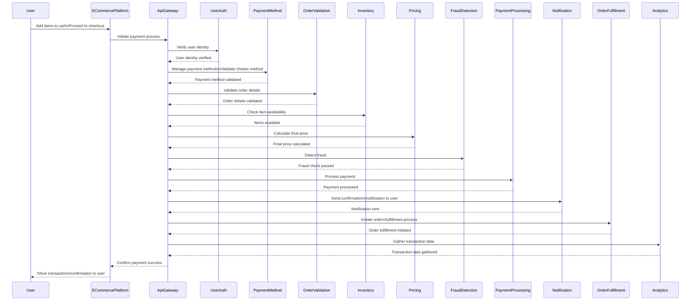

# mermaid-practice

```mermaid

sequenceDiagram
    participant User
    participant ECommercePlatform
    participant ApiGateway
    participant UserAuth
    participant PaymentMethod
    participant OrderValidation
    participant Inventory
    participant Pricing
    participant FraudDetection
    participant PaymentProcessing
    participant Notification
    participant OrderFulfillment
    participant Analytics

    User ->> ECommercePlatform: Add items to cart\nProceed to checkout
    ECommercePlatform ->> ApiGateway: Initiate payment process
    ApiGateway ->> UserAuth: Verify user identity
    UserAuth -->> ApiGateway: User identity verified
    ApiGateway ->> PaymentMethod: Manage payment methods\nValidate chosen method
    PaymentMethod -->> ApiGateway: Payment method validated
    ApiGateway ->> OrderValidation: Validate order details
    OrderValidation -->> ApiGateway: Order details validated
    ApiGateway ->> Inventory: Check item availability
    Inventory -->> ApiGateway: Items available
    ApiGateway ->> Pricing: Calculate final price
    Pricing -->> ApiGateway: Final price calculated
    ApiGateway ->> FraudDetection: Detect fraud
    FraudDetection -->> ApiGateway: Fraud check passed
    ApiGateway ->> PaymentProcessing: Process payment
    PaymentProcessing -->> ApiGateway: Payment processed
    ApiGateway ->> Notification: Send confirmation\nnotification to user
    Notification -->> ApiGateway: Notification sent
    ApiGateway ->> OrderFulfillment: Initiate order\nfulfillment process
    OrderFulfillment -->> ApiGateway: Order fulfillment initiated
    ApiGateway ->> Analytics: Gather transaction data
    Analytics -->> ApiGateway: Transaction data gathered
    ApiGateway -->> ECommercePlatform: Confirm payment success
    ECommercePlatform -->> User: Show transaction\nconfirmation to user


```
